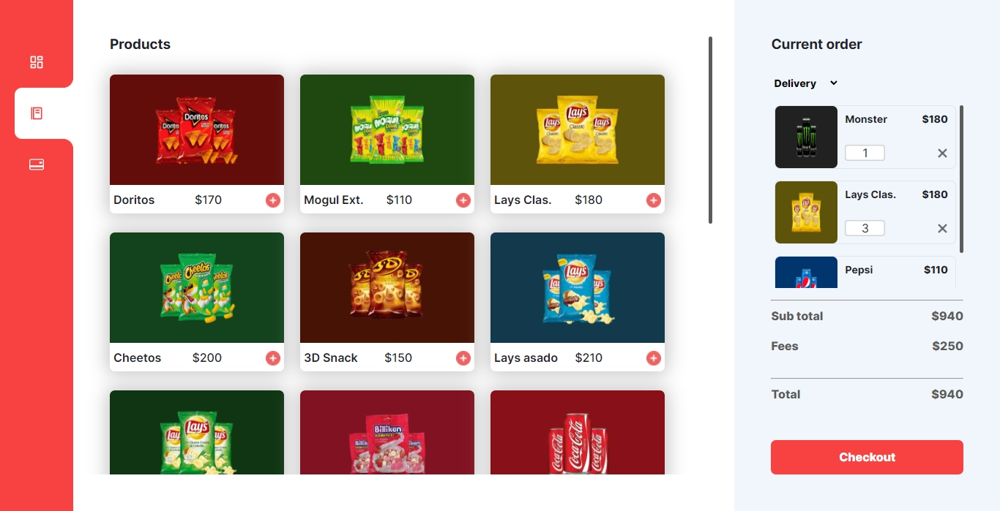
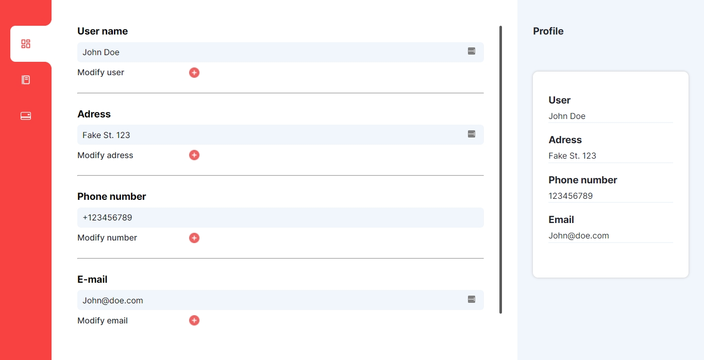
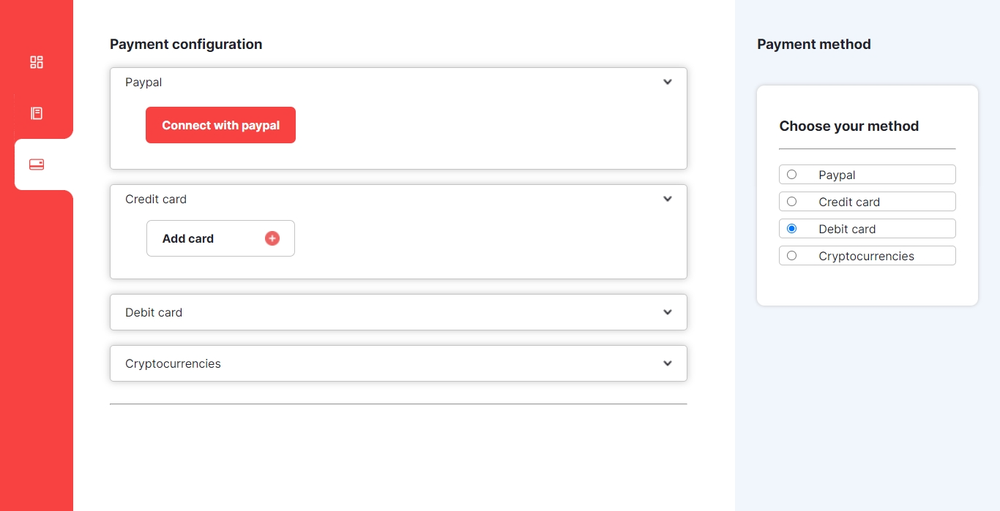
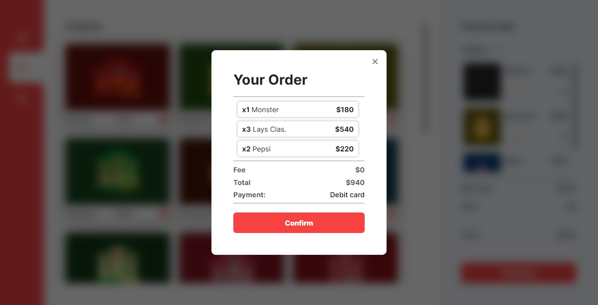

# Curso de JavaScript CoderHouse (Proyecto final 04/02/2022)

# Descripción
Web app que simula la compra de productos. Cuenta con tres apartados (ya que funciona como Single Page Application):
* Un dashboard en donde el usuario puede ingresar sus datos.
* Un Menú en donde se muestran los productos y donde podemos agregarlos al carrito.
* Un apartado donde seleccionar un método de pago (ficticio).
# Tecnologías usadas
* JavaScript
* jQuery (CDN)
* HTML5
* CSS3
# Preview
* ## Dashboard:

* ## Métodos de pago:

* ## Checkout:

* ## Menú:

